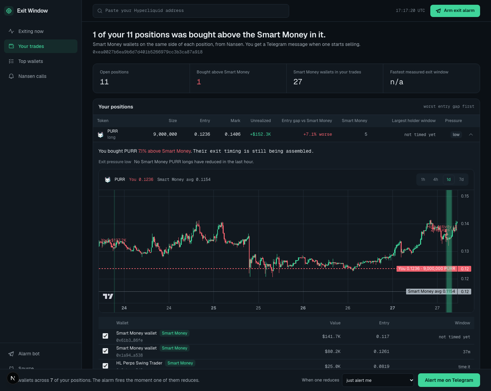
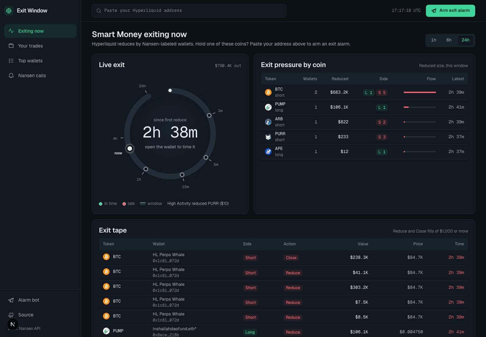
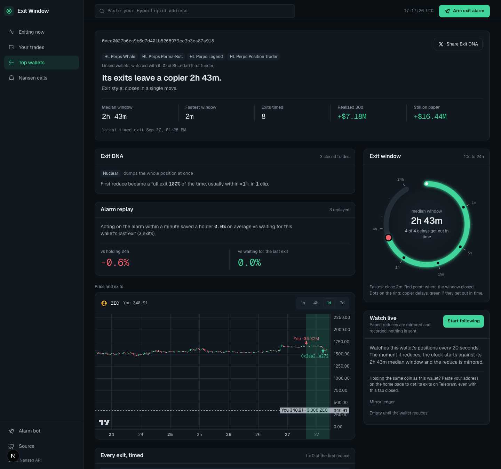
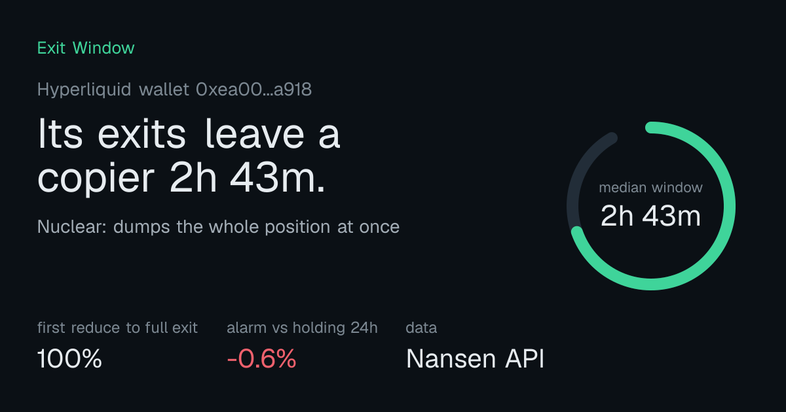
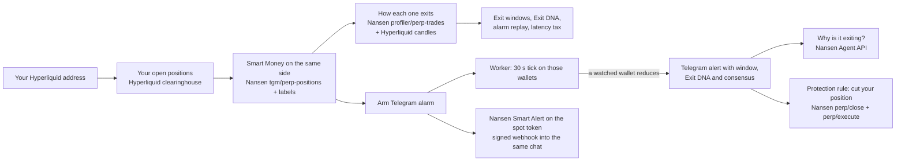

# Exit Window

**You copied the whale's entry. You became its exit liquidity.**

Exit Window is for Hyperliquid traders who already hold a position that Smart Money also holds. Paste your address and it:

1. finds the Smart Money wallets on the same side of each of your positions (Nansen),
2. shows how far above them you bought,
3. shows how each of those wallets exits: how often a first reduce becomes a full exit, how fast, and how many minutes a holder had before price moved 1% against them,
4. arms a Telegram alarm that messages you the moment one of them starts selling, with an optional protection rule that cuts your own position through Nansen's perp trading API.

Built for the Nansen Meridian Buildathon. Nansen is the data layer for every decision in the product; Hyperliquid's public API supplies price candles, live liquidation prices, a free 30-second position tick for the alarm, and a wallet's fills when Nansen credits run out.

- Live: https://exit-window.fly.dev
- Telegram bot: [@nansen_meridian_bot](https://t.me/nansen_meridian_bot)
- Every Nansen call the live product made: https://exit-window.fly.dev/calls. Calls made while building it locally: [`data/nansen-calls.jsonl`](data/nansen-calls.jsonl), summarised in [`docs/API-CALLS.md`](docs/API-CALLS.md).

## Why

Copy traders keep saying the same thing:

> "Copying entries without seeing the exits is how newcomers become exit liquidity" ([@ItsJCOBx](https://x.com/ItsJCOBx/status/2103425326453850425))

> "The only thing I'd copy is the exit, and nobody's seen it yet." ([@0x_rckfrd](https://x.com/0x_rckfrd/status/2103481656413655398), holding the same NEAR long as a whale)

> "ignore what they bought, check what they DIDN'T sell" ([@MaxOnFumes](https://x.com/MaxOnFumes/status/2103566125560938688))

Nansen asked the same question from the other side: *"the more interesting one is how, what they bought, when, how they sized it, when they got out"* ([@nansen_ai](https://x.com/nansen_ai/status/2076633833190068243)). Every other tool answers "who is buying". Exit Window answers "the wallet in your trade is leaving: how long do you have".

## What you see

**Your trades.** Paste your Hyperliquid address. Every position, the Smart Money on the same side, how far above them you bought, and a live chart of your entry against theirs with every Smart Money buy and sell marked as an avatar bubble for the wallet that made it.

A filter bar narrows which Smart Money counts: cohort (Smart Money, whale, public figure), Nansen label (fund, Smart HL Perps Trader, 30/90/180-day Smart Trader, position trader), minimum position size, hide referral-only wallets, and exit risk. The table, the chart and the default alarm watches all follow it.



**Forced exits.** Exit DNA times the exits a wallet chooses. A liquidation is the exit it does not choose, and it sells straight into yours. For every Smart Money holder Nansen puts on your side, Exit Window reads its live liquidation price from Hyperliquid and draws it on your chart with the wallet's avatar. A ladder orders those liquidations against your own, for example: "$2.24M of Smart Money is force-sold before you are liquidated at $2.47" (LIT long, address `0xf21d…3b2d`, read 2026-09-27 18:20 UTC). Holders that Hyperliquid shows have already left since the Nansen snapshot are marked Already out. The alarm builder has a matching scenario: "When price comes within 5% of the largest watched holder's liquidation, message me", checked every tick against Hyperliquid with no Nansen credits spent.

**Exiting now.** Live Smart Money reduces on Hyperliquid, exit pressure by coin, and a dial timing the latest exit.



**Wallet report.** Exit DNA, the alarm replay, and every exit timed on one log scale: how long a holder had after this wallet started selling, and which copier delays got out in time.



**Share a wallet's Exit DNA.** Every report renders its own social card.



## The loop



## How Nansen drives it

| Nansen endpoint | What it decides in the product | Code |
|---|---|---|
| `tgm/perp-positions` (label_type `smart_money`, whale top-up) | Which wallets are in your trade, their entry, size and cohort | `src/lib/nansen.ts`, `src/app/api/overlap` |
| `profiler/perp-trades` | Every fill of a wallet: position episodes, reduces, the exit window, Exit DNA, the copier backtest | `src/lib/positions.ts`, `exitwindow.ts`, `backtest.ts`, `report.ts` |
| `profiler/perp-pnl-summary` | Realized vs paper PnL ("check what they didn't sell") | `src/lib/report.ts` |
| `profiler/perp-positions` | A wallet's open positions on its report page | `src/lib/nansen.ts` |
| `smart-money/perp-trades` | Live Smart Money reduces on the home page, and exit pressure per coin | `src/app/api/feed`, `src/lib/intel.ts` |
| `tgm/position-intelligence` | Smart Trader, whale and public-figure long vs short USD on your coin | `src/lib/intel.ts` |
| `search/general` | Resolves a perp symbol to its token (perp and spot) | `src/lib/intel.ts` |
| `profiler/address/labels` | Who a wallet is (HL Perps Whale, Legend, Position Trader) | `src/lib/intel.ts` |
| `profiler/address/related-wallets` | Linked wallets, watched alongside the whale | `src/lib/intel.ts` |
| `perp-leaderboard` | Wallet discovery | `src/app/api/leaders` |
| `smart-alert` (create, delete) | Nansen watches the spot side of your coin for Smart Money outflows and posts a signed webhook that the bot forwards straight into your alarm chat | `src/lib/intel.ts`, `src/app/api/nansen-webhook` |
| `perp/close`, `perp/execute`, `perp/builder-fee`, `perp/positions` | The protection rule: cut your own position the moment a watched wallet reduces (prepare, sign with your API wallet, execute) | `src/lib/mirror.ts` |

Every call goes through one client (`nansenCall` in `src/lib/nansen.ts`) that caches responses (memory, disk, then a committed seed), dedupes identical in-flight requests, snaps date ranges to 30-minute buckets so repeat reports reuse paid responses, syncs a wallet's fills incrementally, and appends every paid call and every cache hit to `data/nansen-calls.jsonl`. No key or header value is ever written to that log.

## The numbers it computes

- **Exit window**: minutes from a wallet's first reduce until price moved 1% against anyone still holding, on Hyperliquid 1m to 1h candles, shown on a logarithmic dial (10 s to 24 h).
- **Exit DNA**: share of first reduces that became a full exit within 24 h, median minutes from first reduce to flat, median number of clips, and a style: nuclear, scaler, trimmer or mixed.
- **Latency tax**: what a copier mirroring every entry and exit made at 0 s, 1 m, 5 m, 15 m and 1 h delay, after 4.5 bps fees and 5 bps slippage each way, against the wallet's own return. Positions that were already open when the lookback began are excluded from this replay and labeled as such.
- **Entry gap**: your entry against the value-weighted Smart Money entry on the same side.
- **Exit pressure**: of the Smart Money wallets holding your coin and side, how many reduced in the last hour.

## Run it locally (about 5 minutes)

Requirements: Node 22+ (tested on 24.9). No API key is needed to run the demo: the repository ships a seed of paid Nansen responses in `data/nansen-seed` (the demo wallet and its Smart Money), and live positions, prices, fills and liquidation prices come from Hyperliquid's free public API. Add a Nansen API key (https://app.nansen.ai/api) for fresh Nansen data on wallets and coins outside the seed, and a Telegram bot token from [@BotFather](https://t.me/BotFather) for the alarm.

```bash
git clone https://github.com/kamalbuilds/exit-window
cd exit-window
npm install
cp .env.example .env        # optional: NANSEN_API_KEY, TELEGRAM_BOT_TOKEN
npm run dev                 # site on http://localhost:3000, ready in a few seconds
npm run alarms              # second terminal: Telegram alarm worker (needs TELEGRAM_BOT_TOKEN)
npm run sentinel            # third terminal, optional: live Smart Money exit feed, zero Nansen calls
```

Then open http://localhost:3000/me/0xea0027b6ea9b6d7d401b5266979cc3b3ca87a918, a Hyperliquid whale with 11 open positions (ETH, SOL, HYPE, PURR, LIT and others). Each position lists the Smart Money on the same side, the chart of your entry against theirs, and the Forced exits ladder. The top two holders of each position are timed one after another in the background; each takes 15 to 60 seconds on a cold start while their fills and candles load from Hyperliquid. Press **Arm exit alarm** to build a scenario and get the Telegram deep link.

Measured on two fresh clones with no keys set (2026-09-27): clone to dev server up in 28 s on the first, clone to a working demo page in 3 min 11 s on the second (npm install time varies with the network), dev server ready in 4 s, `/api/overlap` for the demo wallet 1.7 s, each holder report 16 to 65 s, `npm test` 254 passing.

Hyperliquid allows 1200 request weight per minute per IP. Every call goes through one limiter (`src/lib/hyperliquid.ts`), and each process takes its share from `HL_WEIGHT_PER_MIN` (default 400, so site, worker and sentinel together stay at 1200).

Optional, for the protection rule to trade for real instead of on paper: `HL_API_WALLET_KEY` (a Hyperliquid API wallet created in the Hyperliquid app, which can trade but not withdraw), `HL_ACCOUNT_ADDRESS`, `MIRROR_MAX_USD` (default 100). The main wallet must approve Nansen's builder fee once before the first order.

Other scripts: `npm test` (vitest), `npm run calls:report` (rewrites `docs/API-CALLS.md`), `npm run cache:seed` (copies paid responses into the seed).

## Telegram alarm

**Arm exit alarm** on `/me` opens a scenario builder that previews the rule as one sentence before you arm it. When:

- any watched wallet reduces, optionally only by at least 10, 25 or 50%,
- 2 or more of them reduce within an hour (consensus),
- the largest holder you watch reduces,
- a wallet rated High exit risk reduces,
- price comes within N% of the largest watched holder's liquidation price.

Then: message you on Telegram, or message and cut your position 25%, 50% or close it, with an optional "Ask Nansen Agent why" button.

`POST /api/alarm` stores the watches and the rule and returns a deep link. Opening it and pressing Start binds your chat. The worker (`scripts/alarm-worker.ts`) then:

- reads each watched wallet's positions from Hyperliquid every 30 seconds (free, no Nansen credits),
- on a reduce of your coin, messages you with the size of the cut, the wallet's median exit window and Exit DNA, and leads with consensus when several wallets in your trade reduce within an hour,
- checks the near-liquidation scenario on the same tick, fires once, and re-arms only after price moves back away,
- runs your cut if the rule has one (sized from your own live position, capped at `MIRROR_MAX_USD`),
- stops watching a coin after you close your own position.

Commands: `/list`, `/stop`, `/test` (a labeled sample built from your real watch data).

## Architecture

```
Browser  ->  Next.js 16 app (src/app)
               /            live Smart Money reduces, wallet search
               /me/[addr]   your positions, Smart Money in them, entry gap, exit pressure, forced exits, filters, alarm builder
               /w/[addr]    one wallet: exit windows, Exit DNA, latency tax, open positions, share card
               /wallets     top Hyperliquid wallets from Nansen's perp leaderboard
               /calls       every Nansen call
             API routes (src/app/api) -> src/lib (nansen, hyperliquid, intel, overlap, forced, report, positions, exitwindow, backtest, mirror, alarms, sentinel)
Worker   ->  scripts/alarm-worker.ts (Telegram long-poll + 30 s Hyperliquid tick)
Sentinel ->  scripts/sentinel.ts (sweeps the Nansen-labeled watchlist on Hyperliquid every 60 s, zero Nansen calls)
State    ->  .cache/ (Nansen responses), data/ (call log, fills, alarms, seed, live exits)
```

Deployed as one Fly.io machine running the site, the worker and the sentinel, with a volume for the cache, call log and alarms (`Dockerfile`, `fly.toml`, `deploy/start.sh`).

Design system: [`DESIGN.md`](DESIGN.md) (a dark Nansen-style app shell; the exit dial is a log-scale chronograph from 10 s to 24 h).
